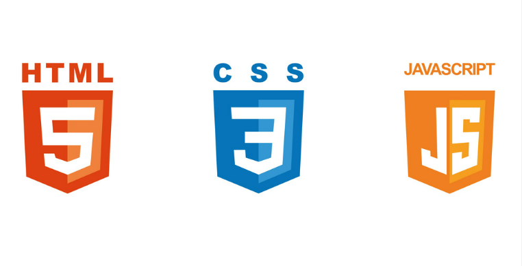

#  Nintendo GameBoy Interactiva
[Nintendo GameBoy Interactiva](https://martaguillemolmos.github.io/console.gameboy/)
 
**Segundo proyecto del Bootcamp Full Stack Developer**
En este proyecto hemos puesto en práctica todos los conocimientos que hemos adquirido, combinando: HTML, CSS y JavaScript.
---

## Índice

- [Tecnologías utilizadas](#tecnologías-utilizadas)
- [Instrucciones de Uso](#instrucciones-de-uso)
- [Instrucciones de Visualización](#instrucciones-de-visualización)
- [Enlace Github Pages](#enlace-github-pages)

## Tecnologías utilizadas:

HTML, CSS y JavaScript[]

## Instrucciones de uso

A continuación, detallaremos los comandos que debemos seguir para poder acceder a uno de los juegos de Mario Bros.

1- Para encender la consola, debemos de hacer click sobre el ON-OFF. Se visualizará el logo de Nintendo GameBoy, junto con la melodía de inicio.
2- Tras encender la consola, haremos click sobre la cruceta izquierda para visualizar los diferentes videojuegos que podemos escoger.
3- Hacer click sobre el botón seleccionar para escoger el juego al que queremos jugar.
4- Pulsaremos sobre A para iniciar el jeugo y nos aparecerá el número de jugadores.
5- Por último, para poder iniciar el juego, tan sólo deberemos pulsar sobre el botónB.

Podremos reiniciar la consola y, volver a la primera pantalla, haciendo click en Reset. Y, por último, para poder apagar la consola. Haremos de nuevo click en el texto superior: ON.OFF.

## Instrucciones de visualización
Para ver el proyecto, puedes acceder a la página web visitando el siguiente enlace: [Nintendo GameBoy Interactiva](https://martaguillemolmos.github.io/console.gameboy/)
Por el contrario, si quieres ejecutar el código localmente, tan sólo debes seguir los siguientes pasos:
1. Descarga todas las carpetas y archivos del repositorio.
2. Abre el archivo `index.html` en tu navegador web.

En esta última opción podrás visualizar el vídeo que aparece en el inicio y al puslar en reset.

---

---

## Mejoras 
Las mejoras que me hubiesen gustado integrar son las siguientes:
1. Visualizar el vídeo del inicio desde GitHub Pages.
2. Aproximarnos más al diseño original de Nintendo GameBoy.
3. Poder interactuar con un videojuego.

---

## Código Fuente
El código fuente de este proyecto se encuentra en el repositorio de GitHub Console - Game Boy. A continuación, detallamos los documentos que lo componen:

index.html: Este archivo HTML es la página principal de la aplicación web y contiene la estructura general de la página.

css/: En esta carpeta se encuentran los archivos CSS que se utilizan para dar estilo a la página. Se han organizado en archivos separados para facilitar la gestión y el mantenimiento del estilo.

js/: En esta carpeta se encuentran los archivos JavaScript utilizados para la interactividad de la página.

img/: Esta carpeta contiene las imágenes y recursos utilizados.

README.md: El archivo README.md contiene la información que estás leyendo actualmente, proporcionando una descripción general del proyecto así como las intrucciones de uso.

Este proyecto ha sido desarrollado utilizando tecnologías estándar web como HTML, CSS y JavaScript.

## Enlace Github Pages

-  [Nintendo GameBoy Interactiva](https://martaguillemolmos.github.io/console.gameboy/)
---
